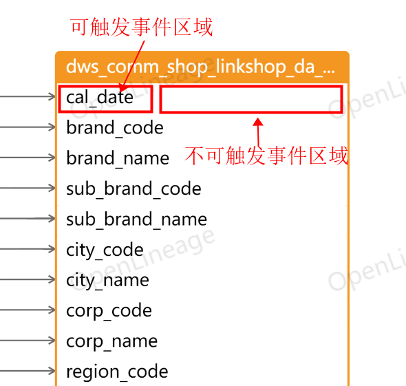
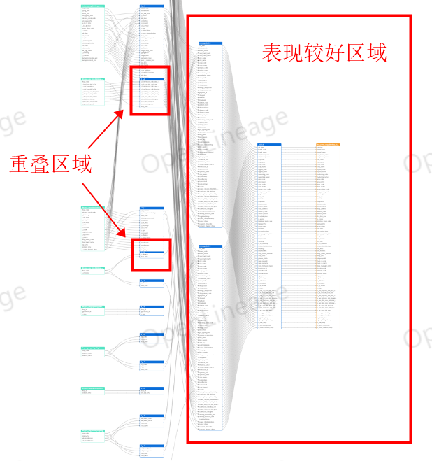
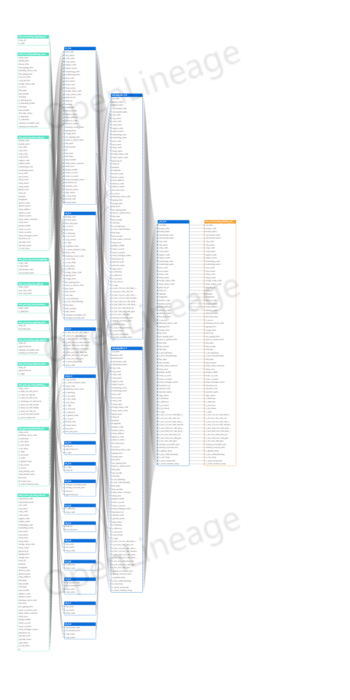
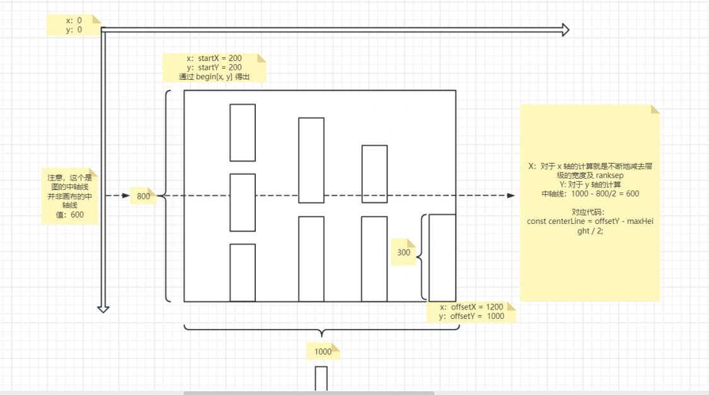
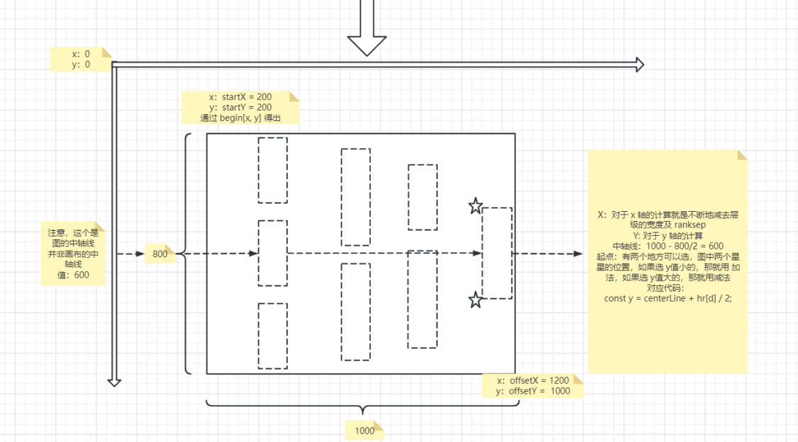

# 数据血缘工具前端项目

## 🎨 OpenLineage 介绍

大数据数据血缘是指数据产生的链路，直白来讲就是我们这个数据是怎么来的，经过了哪些过程和阶段。

## ✨ 已实现功能点

1. 支持解析 Hive sql 生成血缘图，性能高速稳定

2. 支持字段级血缘与表级血缘切换展示

3. 支持完整血缘与不完整血缘链路切换展示

4. 支持血缘高亮显示
   
5. 支持设置血缘高亮颜色

6. 支持画布水印

7. 支持画布拖拽、放大、缩小、自适应、视图居中显示

8. 支持血缘图图片下载

9. 支持小地图拖拽

10. 编辑器支持编写 Sql，美化 Sql 功能

11. 编辑器支持切换主题色

12. 编辑器支持语法高亮

## 了解更多

[项目官网地址](https://openbytecode.com/project/open-lineage)

## 实现细节

这里分享下具体的实现细节，总共有以下几点

1. 如何实现高亮

2. 接口数据如何转化为图数据

3. 表级血缘和字段血缘切换，完整链路和不完整链路切换

接下来我会对每个技术的实现过程进行具体说明

### 1. 如何实现高亮

1.1 定位事件触发字段

鼠标点击 table 字段，如何定位点击的是那个字段？

解决思路：利用图元的 name 属性，AntV G6 官网建议每个图元都加上 name 属性，name 的值是一个字符串，

所以我们可以在构建表字段的时候为 name 赋上我们的字段名

```typescript
if (attrs) {
  attrs.forEach((e: any, i: any) => {
    const { key } = e;
    // group部分图形控制
    listContainer.addShape('rect', {
      attrs: {
        x: 0,
        y: i * itemHeight + itemHeight,
        fill: '#ffffff',
        width: width,
        height: itemHeight,
        cursor: 'pointer',
      },
      name: key,
      draggable: true,
    });

    // group文本控制
    listContainer.addShape('text', {
      attrs: {
        x: fontOffsetX,
        y: (i + 1) * itemHeight + fontOffsetY,
        text: handleLabelLength(key),
        fontSize: fontSize,
        fill: '#000',
        fontWeight: 500,
        cursor: 'pointer',
      },
      name: key,
    });
  });
}
```

上面仅为代码片段，完整请看 https://github.com/lijunping365/Open-Lineage-Web，

注意 name 的值即可。这样就可以在事件触发时定位到触发的是哪个字段了

```typescript
// 监听节点点击事件
graph.off('node:click').on('node:click', (evt: any) => {
  console.log('node:click');
  const { item, target } = evt;
  const name = target.get('name');
  if (!name) return;


  if (fieldCheckedRef.current) {
    handleNodeEvent(graph, item, name);
  } else {
    handleNodeTableEvent(graph, item, name);
  }
});
```

1.2 寻找触发字段的所有来源和目标

上面我们已经定位到触发字段，接着我们需要根据定位到的字段寻找它的上下游字段及连线以实现高亮，

我们可以顺着连线去找，我们知道 edge 都有来源和目标，所以可以分为左右两个方向去找

```typescript
/**
 * 获取选中 label 的所有左关联边
 * @param edges node 的所有 edges
 * @param model node 的 model
 * @param sourceAnchor 选中的 label
 * @param leftActiveEdges 左关联边集合
 */
export const getLeftRelation = (
  edges: any[],
  model: any,
  sourceAnchor: any,
  leftActiveEdges: any[]
) => {
  const source = model['id']; // 当前节点
  edges
    .filter((edge: any) => !leftActiveEdges.includes(edge))
    .forEach((edge: any) => {
      if (
        edge.getModel()['target'] === source &&
        edge.getModel()['targetAnchor'] === sourceAnchor
      ) {
        leftActiveEdges.push(edge);

        const currentNode = edge.getSource();
        const currentModel = currentNode.getModel();
        const currentEdges = currentNode.getInEdges();
        const currentSourceAnchor = edge.getModel()['sourceAnchor'];
        getLeftRelation(
          currentEdges,
          currentModel,
          currentSourceAnchor,
          leftActiveEdges
        );
      }
    });
};

/**
 * 获取选中 label 的所有右关联边
 * @param edges node 的所有 edges
 * @param model node 的 model
 * @param sourceAnchor 选中的 label
 * @param rightActiveEdges 右关联边集合
 */
export const getRightRelation = (
  edges: any[],
  model: any,
  sourceAnchor: any,
  rightActiveEdges: any[]
) => {
  const source = model['id']; // 当前节点
  edges
    .filter((edge: any) => !rightActiveEdges.includes(edge))
    .forEach((edge: any) => {
      if (
        edge.getModel()['source'] === source &&
        edge.getModel()['sourceAnchor'] === sourceAnchor
      ) {
        rightActiveEdges.push(edge);

        const currentNode = edge.getTarget();
        const currentModel = currentNode.getModel();
        const currentEdges = currentNode.getOutEdges();
        const currentTargetAnchor = edge.getModel()['targetAnchor'];
        getRightRelation(
          currentEdges,
          currentModel,
          currentTargetAnchor,
          rightActiveEdges
        );
      }
    });
};
```

1.3 对寻找到的所有字段和连线进行高亮

在上一步中，我们找到了事件触发的字段以及字段的所有来源和目标字段及连线，接下来就是对找到的这些字段和连线进行高亮

> 字段高亮：将字段字体加粗
>
> 连线高亮：将连线颜色改为其他颜色

要实现高亮，那就要动态修改元素的样式（状态），通过阅读 AntV G6 的文档，知道了通过动态设置元素的 state 可以实现我们想要的效果

关键点：在修改状态的时候要拼接上要高亮的字段，这样在处理高亮的时候就可以知道要操作哪个字段了

```typescript
/**
 * 设置左边关联节点及边状态
 * @param graph 
 * @param edges 连线
 * @param color 连线高亮颜色
 * @param name 状态名称
 */
export const setLeftStats = (
  graph: any,
  edges: any[],
  color: string,
  name: string
) => {
  if (!graph) return;
  edges.forEach(function (edge: any) {
    graph.setItemState(edge, `highlight-${color}`, true);
    edge.toFront();

    const sourceAnchor = edge.getModel()['sourceAnchor'];
    graph.setItemState(edge.getSource(), name + '-' + sourceAnchor, true);
  });
};
```

处理字段高亮代码如下，在设置高亮时截取到高亮字段，找到高亮元素进行高亮即可，注意这里是通过 keyShape 去查找的

```typescript
setState(name, value, item: any) {
  // 字段高亮
  if (name && name.startsWith('highlight')) {
    const anchor = name.split('-')[1];
    const shape = item.get('keyShape');
    // 查找 label 下标
    const anchorIndex = item.getModel().attrs.findIndex((e: any) => e.key === anchor);
    // 查找 label 元素，通过下标来找
    const label = shape.get('parent').get('children')[3].get('children')[
    anchorIndex * 2 + 1
      ];

    if (value) {
      //label.attr('fill', '#A3B1BF');
      //label.attr('fill', 'red');
      label.attr('fontWeight', 800);
    } else {
      //label.attr('fill', '#A3B1BF');
      //label.attr('fill', 'red');
      label.attr('fontWeight', 500);
    }
  }
}
```

处理连线高亮代码如下:

```typescript
/**
 * 设置状态，主要用于高亮
 * @param name 状态
 * @param value true | false
 * @param item 要改变状态的边
 */
setState(name, value, item: any) {
  const shape = item.get('keyShape');
  // 字段连线高亮或表连线高亮
  if (name && name.startsWith('highlight')) {
    const highlightColor = name.split('-')[1];
    if (value) {
      //shape.attr('opacity', 0.2);

      shape.attr('stroke', highlightColor);
      shape.attr('lineWidth', 3);
    } else {
      //shape.attr('opacity', 1);

      shape.attr('stroke', '#6C6B6B');
      shape.attr('lineWidth', 2);
    }
  }
}
```

### 2. 接口数据转化为图数据

2.1 接口数据如下，我简单说明下每个字段的含义

targetField：目标，对应图的 target

refFields：来源：对应图的 source

> 一个目标可以有多个来源

fieldName： 数据库、表、字段使用 “.“ 分隔

level：层次布局层级

index：同一层的 order

final：是否是最后一层，true 最后一层，false：不是最后一层

```json
[
  {
    "refFields": [
      {
        "fieldName": "default._u1.cal_date",
        "final": false,
        "index": 0,
        "level": 1
      }
    ],
    "targetField": {
      "fieldName": "dws.dws_comm_shop_linkshop_da.cal_date",
      "final": false,
      "index": 0,
      "level": 0
    }
  },
  {
    "refFields": [
      {
        "fieldName": "default._u1.brand_code",
        "final": false,
        "index": 0,
        "level": 1
      }
    ],
    "targetField": {
      "fieldName": "dws.dws_comm_shop_linkshop_da.brand_code",
      "final": false,
      "index": 0,
      "level": 0
    }
  }
]
```

2.2 图由节点（Node）和连线（Edge）组成，节点和连线的数据结构分别如下

图节点数据结构如下，id、key、label、x、y、attrs、size 是节点必须要有的属性，level 和 order 是我们自定义的属性，

level 用在实现 table 不同颜色，order 用在自定义布局

```json
{
  "id": key,
  "key": key,
  "label": key,
  "x": 100,
  "y": 100,
  "level": level,
  "order": order,
  "attrs": attrs,
  "size": [400, height]
}
```

图连线数据结构如下

```json
{
  "source": sourceName,
  "sourceAnchor":sourceAnchor,
  "target": targetName,
  "targetAnchor" : targetAnchor,
  "label": ref.label
}
```

2.3 数据转换

具体代码在 /utils/common.ts 中，有兴趣的可以看下

### 3. 表级血缘和字段血缘切换，完整链路和不完整链路切换

这个其实比较简单，思路对了就很好解决，比如表级血缘和字段血缘切换，其实就是在展示字段血缘的时候把节点的 attrs 属性的值置为空数组即可

不完整链路需要接口返回。

## ❓ 遇到的问题

这里再分享下在项目实现的过程中遇到的一些问题，帮助大家在遇到类似的问题的时候该如何解决，不过最终都在 AntV G6 的官网上和官网群聊中找到了答案

1. 渲染之后调用 fitView() 方法不生效

```typescript
/**
 * 渲染视图
 */
export const renderGraph = (graph: any, lineageData: any) => {
  if (!graph || !lineageData) return;
  graph.data(lineageData);
  graph.render();
  graph.fitView();
};
```

最后在 AntV G6 官网找到答案

https://g6.antv.antgroup.com/api/graph#graphoptionsfitview

也就是说要在初始化 Graph 的时候设置 fitView 为 true 才生效

```typescript
graphRef.current = new G6.Graph({
  container: container || '',
  width: width,
  height: height,
  plugins: [grid, minimap, toolbar],
  fitView: true,
  modes: {
    default: ['drag-canvas', 'zoom-canvas', 'drag-node'],
  }
})
```

2. 点击字段空白处不触发事件



定义的事件如下，点击图中可触发事件区域可以触发事件，但是点击图中不可触发事件区域未能触发事件

```typescript
// 监听节点点击事件
graph.off('node:click').on('node:click', (evt: any) => {
  const { item, target } = evt;
  const currentAnchor = target.get('name');
  if (!currentAnchor) return;

  if (fieldCheckedRef.current) {
    handleNodeClick(graph, item, currentAnchor, 'highlight');
  } else {
    handleNodeClick(graph, item, currentAnchor, 'tableHighlight');
  }
});
```

这个问题比较有意思，最后在也是通过对比官网案例最终找到了答案，

官网案例：https://g6.antv.antgroup.com/examples/interaction/partialResponse#partialNode

经过对比发现：例子中的蓝色小圆是填充了蓝色，而我们的没有填充，所以猜测可能是我们的字段矩形没有填充东西，也就是所矩形是空的，所以监听不到事件。

填充之前的代码如下：

```typescript
attrs.forEach((e: any, i: any) => {
  const { key } = e;
  // group部分图形控制
  listContainer.addShape('rect', {
    attrs: {
      x: 0,
      y: i * itemHeight + itemHeight,
      width: width,
      height: itemHeight,
      cursor: 'pointer',
    },
    name: key,
    draggable: true,
  });
})
```

给矩形填充白色

```typescript
attrs.forEach((e: any, i: any) => {
  const { key } = e;
  // group部分图形控制
  listContainer.addShape('rect', {
    attrs: {
      x: 0,
      y: i * itemHeight + itemHeight,
      fill: '#ffffff',
      width: width,
      height: itemHeight,
      cursor: 'pointer',
    },
    name: key,
    draggable: true,
  });
})
```

正如我们猜测的那样，填充颜色之后果然能够监听到事件了。

3. 使用 dagre 布局有一些表局部有重叠和间距不一致问题



最后通过在 AntV 官方交流群交流之后确定，这应该是我们数据的问题，这里再次感谢他们的解答，也就是说应该是接口返回的数据中同一层级有多个相同的 index 导致

一些表局部有重叠和间距不一致现象。所以后面尝试了下自定义布局，针对目前的数据探索解决方案，目前自定义布局已完成

先看下效果图：



特点：

1. 层次布局

2. 整体居中对齐，以中线上下等距

3. 节点之间没有重叠

4. 节点之间距离相等

5. 层次之间距离相等

## 自定义布局

未居中对齐时：



居中对齐后：



主要代码：

```typescript
/**
   * 执行布局
   */
public execute() {
  const self = this;
  const { nodes, edges, ranksep, nodesep, begin } = self;
  if (!nodes) return;
  const layerMap: Map<number, Node[]> = new Map();
  nodes.forEach((item: any, index, arr) => {
    if (!layerMap.has(item.level)) {
      layerMap.set(
        item.level,
        arr.filter((node: any) => node.level === item.level)
      );
    }
  });

  // TODO 重新调整层级
  const startX = begin[0];
  const startY = begin[1];
  const size = layerMap.size;
  const maxWidth = size * nodeWidth + (size - 1) * ranksep;
  const hr = Array.from(layerMap.values()).map((list: any[]) => {
    const sum = list.reduce((pre: any, curr: any) => {
      return pre + curr.size[1];
    }, 0);
    return sum + (list.length - 1) * nodesep;
  });
  const maxHeight = Math.max(...hr);
  const offsetX = startX + maxWidth;
  const offsetY = startY + maxHeight;
  const centerLine = offsetY - maxHeight / 2;

  layerMap.forEach((value, key) => {
    let d = key === maxLevel ? size - 1 : key;
    const x = offsetX - d * (nodeWidth + ranksep);
    const y = centerLine + hr[d] / 2;
    const sortNodes = value.sort((x: any, y: any) => y.order - x.order);
    let preY = y;
    sortNodes.forEach((e: any, index) => {
      const { size } = e;
      const margin = index === 0 ? 0 : nodesep;
      preY = preY - size[1] - margin;
      e.x = x;
      e.y = preY;
    });
  });
  if (self.onLayoutEnd) self.onLayoutEnd();
}
```

完整代码路径：/src/components/Layout/

## 🎉 贡献指南

欢迎大家提交 issues 和 pr，欢迎 star，本项目将会持续更新，感谢大家的支持

## 交流群


## License

[MIT](LICENSE)
